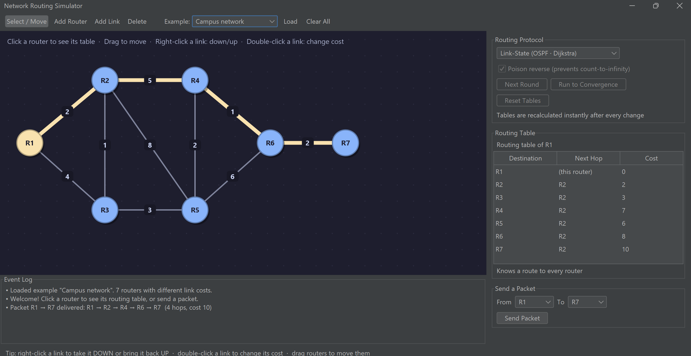
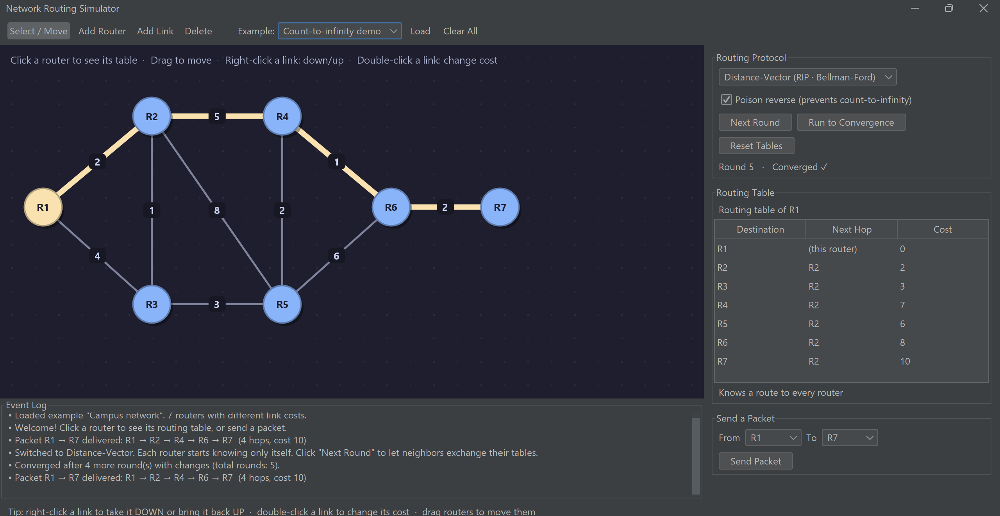

# Network Routing Simulator


An interactive desktop application that simulates how routers build their routing tables and forward packets, built with **Java 21**, **Swing**, and **Maven**.

Draw a network of routers and links, then compare the two main families of routing protocols:
- **Link-State** (like **OSPF**), where every router runs **Dijkstra's algorithm**
- **Distance-Vector** (like **RIP**), where routers exchange tables in rounds using the **Bellman-Ford** rule

You can break links, watch the tables re-converge round by round, reproduce the **count-to-infinity** problem, and see how **poison reverse** fixes it. Packets are animated hop by hop, following each router's table exactly like a real router would.





## Features

**Network editor**
- Add, move, and delete routers and links with the mouse
- Set a cost (1–20) on each link, change it with a double-click
- Take a link **down** or bring it back **up** with a right-click (simulates a cable failure)
- 4 ready-made example networks: campus, mesh, ring, and a count-to-infinity demo

**Link-State routing (OSPF)**
- Each router runs Dijkstra's algorithm on the full topology
- Tables are recalculated instantly after every change

**Distance-Vector routing (RIP)**
- Routers start knowing only themselves and learn from their neighbors, one round at a time
- **Next Round** to step through the exchange, or **Run to Convergence**
- Shows the round number and whether the network has converged
- Optional **poison reverse**: without it, a link failure causes the count-to-infinity problem and temporary routing loops

**Packet forwarding**
- Send a packet between any two routers and watch it travel hop by hop
- Detects and explains every outcome: delivered, no route, **routing loop**, or **link down** (tables out of date)

**Routing tables**
- Click any router to see its table: destination, next hop, and total cost

## How It Works

| | Link-State (OSPF) | Distance-Vector (RIP) |
|---|---|---|
| What a router knows | The full network map | Only its direct neighbors |
| Algorithm | Dijkstra | Bellman-Ford |
| Convergence | Immediate | Several rounds |
| After a link failure | Recalculates immediately | Can count to infinity without poison reverse |

**Distance-Vector update rule** (applied by every router, every round):

```
cost(destination) = min over neighbors N of ( link cost to N + N's advertised cost to destination )
```

With **poison reverse**, a router advertises a cost of infinity (64) to the neighbor it uses to reach that destination, which prevents two routers from bouncing a dead route back and forth.

## Architecture

```
src/main/java/com/netsim/
├── model/
│   ├── Router.java              # a node in the network
│   ├── Link.java                # a two-way link with a cost and up/down state
│   ├── Network.java             # routers + links
│   └── NetworkPresets.java      # example networks
├── routing/
│   ├── LinkStateRouting.java    # Dijkstra with next-hop tracking
│   ├── DistanceVectorRouting.java  # round-based Bellman-Ford, poison reverse
│   ├── Forwarding.java          # follows tables hop by hop, detects loops
│   ├── RoutingTable.java
│   └── RouteEntry.java
├── ui/
│   ├── MainWindow.java          # toolbar, side panel, event log
│   ├── NetworkCanvas.java       # drawing, mouse editing, packet animation
│   └── Theme.java
└── Main.java
```

The routing logic has no dependency on the user interface, so it is fully covered by unit tests.

## Getting Started

Requires **Java 21+** and **Maven**.

```bash
git clone https://github.com/kassembeirouty/network-routing-simulator.git
cd network-routing-simulator
mvn package
java -jar target/network-routing-simulator.jar
```

## Tests

```bash
mvn test
```

27 JUnit 5 tests verify that:
- Dijkstra finds the cheapest cost and the correct next hop, and reroutes around failed links
- Distance-Vector converges to exactly the same costs as Link-State on 25 random networks
- Without poison reverse, a link failure causes count-to-infinity (dozens of rounds) and a routing loop
- With poison reverse, the same failure converges in at most 3 rounds
- Packets are delivered along the cheapest path, and unreachable destinations, loops, and dead links are detected
- Every example network is fully connected

## Tech Stack

Java 21 · Swing · FlatLaf (dark theme) · Maven · JUnit 5 · GitHub Actions